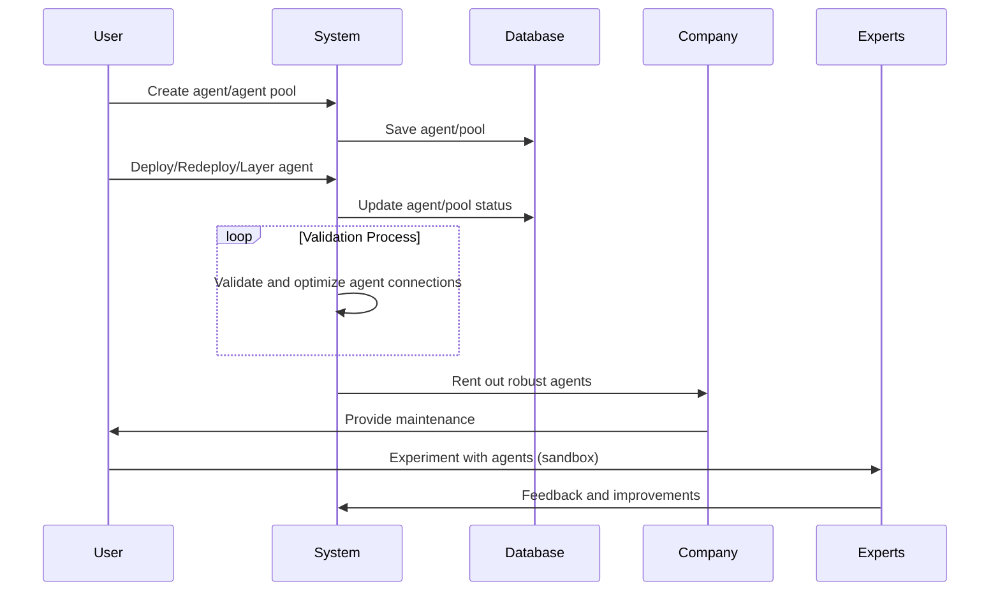

# Proposal for Re-Use & Re-Design Flawed Reward System

Git-Approach to bring light into our scrollable, short-lived world

## Abstract

Want to jump the theory?

- [Video](#video)
- [Demo](#demo)
- [Repo (Unlicense license)](#repo-unlicense-license)

## Table of Contents

- [Abstract](#abstract)
- [Introduction](#introduction)
- [The Problem](#the-problem)
- [Solution Pillars](#solution-pillars)
- [Immediate Goals](#immediate-goals)
- [Future Vision](#future-vision)
- [Time-Stamped Content Evolution Graphs](#time-stamped-content-evolution-graphs)
- [The Wire-Box or Augmented Argumentation via Agent Interactions](#the-wire-box-or-augmented-argumentation-via-agent-interactions)
    - [Why the Wire-Box](#why-the-wire-box)
    - [Business-Model for Sub-Module Wire-Box](#business-model-for-sub-module-wire-box)
- [Why all of that](#why-all-of-that)
- [In Sum](#in-sum)
- [Join](#join)
- [References](#references)

## Abstract

Let's enumerate in one section what this is all about (yes, we do repeat Personal Knowledge Library (PKL) definition on
purpose):

- **Overarching Goal**: A social-network consisting of Knowledge Graphs in the form of Personal Knowledge Libraries (
  PKL)
- **Public Section of Personal Knowledge Library (PKL)** as a way to build up knowledge adhering to "standing on the
  shoulders of giants"
- **Git-Approach to Personal Knowledge Library (PKL)** adheres to "cross-validation" principles, by forking out,
  reassessing and making a pull-request/ merge back in the original Personal Knowledge Library (PKL)
- By visualizing the intellectual trajectories of thought and discovery in the Public Section of the Personal Knowledge
  Library (PKL), we enable some kind of "reproducibility"
- Use The Wire-Box [link] or Augmented Argumentation via Agent Interactions to encapsulate expert knowledge and an
  infinite universe of further options
- Plot and re-use a flawed reward system

## The Problem

Today's "infinite scroll"/"slot-machine"⁰ presents content—whether posts, images, or videos—in a seemingly endless,
disconnected stream. This disconnect impedes users from delving into interconnected topics, depriving them of a cohesive
understanding. Furthermore most of these platforms and even more scientific ones e.g. nature journal, are triggered by
the rewards of quick wins & news coverage¹. Such superficial and short-lived scrolling news contrasts sharply with
Knowledge Graphs, where interconnected pathways usher users to deeper insights² and to track the history & performance
of news-commits (think of "from-event-to-release" and "interaction" KPIs as cross-validation approaches what the
news-commit is aimed at [identify targeting patterns -- reusing the flawed reward system]).

## Solution Pillars

- **Personal Knowledge Libraries (PKL)**

Example: Imagine Instagram's chronological photo feed, but instead of photos, you have nodes representing key thoughts,
ideas, or memories. Or consider LinkedIn , where connections don't just represent professional relationships, but
conceptual links between ideas. In essence, PKL isn’t just another social media platform—it's a fusion that amalgamates
the essence of Instagram's visual storytelling, Twitter's/ X's bite-sized thoughts, LinkedIn's professional sharing, and
even Tinder's interactive engagement, all aimed at charting the growth of a person's intellectual journey³. But NOT
based on scrolling and swiping thus enhancing our endorphin and dopamine roller coaster but consisting of wandering or
rather strolling in a considered manner the graph-edges.

## Immediate Goals

One immediate goal is to design a platform for knowledge graph generation based on the API layer of the above-mentioned
existing 'social-networks' platforms. This platform will consist of modules for 'Time-Stamped Content Evolution Graphs'
and 'Augmented Argumentation via Agent Interactions' (as described below). Additionally, we need to obtain a decisive
overarching legal decision from the national authorities stating that users own the content they create and publish on
the 'social-networks'. Furthermore that Users must have the ability to export their content from the respective
platform, following the REST standards.

The next step involves displaying to the user the content/knowledge they have accumulated so far in the consolidated
Personal Knowledge Library (PKL), based on graph analysis (DFS, degrees, etc., providing basic statistics).
Subsequently, users will have the opportunity to collaborate with the community, bridging what was previously segregated
across platforms and addressing the shortcomings of the existing formats and (flawed-) reward system.

## Future Vision

Pair PKL with virtual reality. Visualize a personal 3D knowledge universe weaving an immersive narrative of evolving
thoughts. Like navigating a cerebral museum, every node and connection breathes life into the intellectual universe⁴ and
could help others on similar problems and stages of life.

Imagine sth like
this: https://anvaka.github.io/pm/#/galaxy/python?cx=-2700&cy=377&cz=5622&lx=-0.0869&ly=-0.2315&lz=-0.0338&lw=0.9684&ml=150&s=1.75&l=1&v=2015-09-27T13-00-00Z
of Andrei Kashcha

View on "Code Galaxies Visualization" of Andrei Kashcha

### Time-Stamped Content Evolution Graphs

Example: Both A Dangerous Game⁶ and Arrival⁷ challenge conventional understandings of time as a fixed, linear
progression. Whereas Dürrenmatt explores the re-evaluation of past events as a means of interrogating the present,
Arrival presents a narrative in which the future can be perceived and interacted with in the present moment. These works
collectively suggest a more fluid, interconnected conception of time, which in turn invites a re-evaluation of our own
understandings and experiences of temporality. Similarly, consider how politicians’ promises and speeches often shift
with context and audience, or how 'Fake News' muddies our information streams. The challenges of discerning fact from
fiction and tracing the evolution of statements becomes daunting⁸.

Enter our git-versioned (thanks Linus Torvalds who would never use LinkedIn I guess :D) content graph universe. Instead
of scrutinizing right from wrong, this system records 'commits'—versions of content from specific sources at specified
times. Users can trace the evolution of narratives, spot inconsistencies, or recognize recurring patterns⁹ (e.g.
targeting patterns like mentioned in the intro). Want a deeper dive? Fork a branch, revisit a statement’s version, and
layer it with your insights or perspectives into your PKL or cluster it into an agent-pool (see below).

Current Status: MVP in Development.

### The Wire-Box or Augmented Argumentation via Agent Interactions

Following our git-versioned content graphs, visualize a box of wires, akin to the neural connections in our brain. These
are the edges, the links, the pathways of thoughts users can customize¹⁰. Users can segment their thought processes,
encapsulate them within agents, and interlink them¹¹. For instance, if you've been tracking a politician's statements on
climate change, you could have an agent encapsulating all related environmental data, another with socio-economic
implications, and another with global political reactions.

These agents, then, aren't just isolated data points—they're interconnected facets of your understanding. They can
interact, validate, or even challenge each other based on the connections you've made, mimicking the internal dialogues
we often have when trying to understand complex topics.

Current Status: MVP Available [here](link to MVP).

Wire-it Ben! ¹⁴

#### Why the Wire-Box

Heads-Up: We wrote this part of the proposal 02.11.2023 and only just realised that this is partly the Vision of
OpenAI (or what is known up to now 00:31:40 https://www.youtube.com/watch?v=U9mJuUkhUzk). However, what OpenAI is
missing is the Graph-Approach to Agent  (David Shapiro we will use some of your repos to integrate Assistants besides
Chat-Completion-Agents currently integrated) communication thus the users can't layer the agents, as of now.

We could say we designed the Wire-Box because we had a dream that non-technical people could use the power of
graph-based agent behavior too. But that would be just a part of it. We created it because we want to use expert
knowledge. For example experts of empathy, in psychology, in creativity, in physics, in chemistry, in medicine, in any
kind of expertise field. But the point is, if they don't know how to use custom instruction or how to layer agents and
if they don't have any idea how to use graphs at all in the connection with agents, then we are missing an opportunity.
Because we're sure that those expert fields left their traces in the language corpus that GPT uses. Now if the experts
manage to unlock this knowledge in a meaningful way, we're at this sub-moduls goal. So we would suggest that all these
experts put themselves in the position of seeing themselves as keys. They are for me, for us, for the society, the keys
to unlock the right kind of wiring between the agents, the right kind of layering of the agents in order to get a
robust, reliable, reproducible outcome. So this is our true reason for the Wire-Box.

#### Business-Model for Sub-Module Wire-Box

The following business-model is in line with the Revenue-Sharing OpenAI (same reference as
above https://www.youtube.com/watch?v=U9mJuUkhUzk) is teasing, just that our approach would also focus on integrating OS
llms with the ability of agent behaviour so as to give the user a chance for assesing which agents of which llms are
best for the use case (different attention heads etc.).
**Business-Model**

**Description:**

- Agent/Agent Pool Creation: Users (U) initiate the process by creating agents or agent pools based on their (expert)
  knowledge.
- Saving to Database: Once an agent or agent pool is created, the System (S) saves this information in a Database (DB).
  This step ensures that all agent data and configurations are securely stored and managed (sorry for the MVP it's a
  save to a DWH because of cost implications).
- Deployment and Layering: Users have the ability to deploy, redeploy, or layer their agents. This means they can
  initiate the agent, make modifications, or combine it with other agents or pools to enhance its capabilities or
  efficiency. (Not in MVP)
- Status Update and Validation: As agents are deployed or modified, the System updates their status in the Database.
  Concurrently, there's an ongoing validation process where the System continually validates and optimizes the
  connections and interactions between agents. This loop represents the process of continuous improvement and
  optimization of the agents. (Not in MVP)
- Renting Out Robust Agents: Once agents are deemed robust and efficient through the validation process, the System (
  representing the Company, C) rents them out. This implies that other entities or customers can use these
  well-developed agents, likely for a fee. (Not in MVP)
- Maintenance and Experimentation: While the Company is responsible for the maintenance of these agents, ensuring they
  run smoothly and effectively, Users are given the opportunity to experiment with these agents in a sandbox
  environment. This environment allows Users to test and experiment without affecting the live, operational versions of
  the agents.
- Feedback Loop with Experts: Experts (E), who might be more advanced users or specialists in the field, use these
  agents and provide feedback and suggestions for improvements to the System. This feedback is crucial for the ongoing
  development and refinement of the agents. (Not in MVP)

## Why all of that

The game design of Hideo Kojima's Death Stranding, Kojima Productions, recognizes the profound significance of human
connections⁵. This brought us to write the proposal. In a world characterized by isolation, the game symbolizes the deep
human need to establish and nurture connections (in a healthy way, not the flawed systems we're deriving endorphin and
dopamin from like Instagram / X / YouTube / Tinder / LinkedIn). Similarly, PKL seeks to create bridges between isolated
knowledge nodes, facilitating intellectual interactions and growth (if you don't know the game, check out 00:22:14 - 00:
24:56 && 00:26:59 - 00:28:13 in order to understand the reward
system https://www.youtube.com/watch?v=FFtYXoOowKQ&ab_channel=Gingy). This paired with the gaining speed of the usage of
knowledge graphs and the crumbeling of language barriers (we do mean all kind of languages as we can now use LLMs to
translate not only words but meaning), makes the time feel as right as it could be to submit this proposal to the WWW.

## In Sum

Our endeavor is not merely to refine the digital landscape (cheers to Chamath Palihapitiya, Social Capital) but to
transform it into a bastion of deep, systematic exploration rooted in the principles of (scientific) inquiry. By
championing principles such as "standing on the shoulders of giants"  we acknowledge the cumulative, interconnected
nature of understanding. Through "cross-validation" which is inherent in the git-system, we embrace the rigorous
scrutiny of ideas, mirroring the peer-review process that bolsters insight. Most crucially, by championing "
reproducibility" we want to ensure that the path to insight—each node and edge of connection—is not only transparent but
navigable by others — in the spirit of "Understanding instead of judging" ("Comprendre au lieu du juger")¹² — it is our
conviction that by visualizing the intellectual trajectories of thought and discovery, we empower others to follow¹³,
comprehend, and expand upon them. Every participant is both a learner and a contributor or can inherite
reaction-patterns to agent/-pools, each personal library a chapter in a grander compendium of human intellect.

With these pillars, we aspire to give an alternative to the short-lived, buzzword-heavy, scrollable, swipable
knowledge-transfer, that we're indulging in at the moment.

## Join

If you resonate with our vision, consider giving me constructive feedback or give me a "duplicated" (please refer the
source in case there is already a solution as described above), forward this proposal, come up with an own approach,
fork my repo, use the app to layer agents. If you want to know more about the "We"/ "Us", check here.

## References

⁰ @Orlowski, J. (Director). (2020). The Social Dilemma [Film]. Exposure Labs; Argent Pictures; The Space Program;
Netflix.

¹ Veritasium. Derek Muller (2023, Nov 01). The Problem With Science Communication [Video].
YouTube. https://www.youtube.com/watch?v=czjisEGe5Cw&ab_channel=Veritasium

² Shneiderman, B. (1996). The eyes have it: A task by data type taxonomy for information visualizations.
Proceedings IEEE Symposium on Visual Languages.

³ Boyd, D. M., & Nicole Ellison Ellison, N. B. (2007). Social network sites: Definition, history, and
scholarship. Journal of Computer‐Mediated Communication, 13(1), 210-230.

⁴ Milgram, P., & Fumio Kishino Kishino, F. (1994). A taxonomy of mixed reality visual displays. IEICE
TRANSACTIONS on Information and Systems, 77(12), 1321-1329.

⁵ Kojima, H. (2019). Death Stranding. Sony Interactive Entertainment.

⁶ Dürrenmatt, F. (1956). A Dangerous Game (also known as "The Pledge"). Alfred A. Knopf.

⁷ Villeneuve, D. (Director). (2016). Arrival [Film]. Note: Based on the story "Story of Your Life" by Ted Chiang.

⁸ Tandoc Jr, E. C., Zheng Wei Lim Lim, Z. W., & Richard Ling Ling, R. (2018). Defining “fake news.” Digital
Journalism, 6(2), 137-153.

⁹ Dabbish, L., Colleen Stuart Stuart, C., Jason Tsay Tsay, J., & Jim Herbsleb Herbsleb, J. (2012). Social
coding in GitHub: transparency and collaboration in an open software repository. Proceedings of the ACM 2012 conference
on Computer Supported Cooperative Work.

¹⁰ Sporns, O. (2011). Networks of the brain. MIT press.

¹¹ Russell, S. J., & Norvig, P. (2010). Artificial intelligence: A modern approach. Malaysia; Pearson
Education Limited.

¹² Camus, Albert (1957). The Nobel Prize in Literature 1957. [Online; accessed 1.Apr.2020]
.URL:https://www.nobelprize.org/prizes/literature/1957/camus/25232-albert-camus-banquet-speech-1957.

¹³ Bates, M. J. (2005). Information and knowledge: An evolutionary framework for information science.
Information Research, 10(4).

¹⁴ The Walt Disney Company. (2002). Treasure Planet [Film]. Walt Disney Feature Animation.

